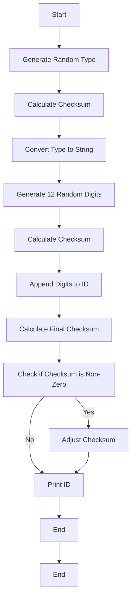

```mermaid
graph TD;
    A[Start] --> B[Generate Random Type];
    B --> C[Calculate Checksum];
    C --> D[Convert Type to String];
    D --> E[Generate 12 Random Digits];
    E --> F[Calculate Checksum];
    F --> G[Append Digits to ID];
    G --> H[Calculate Final Checksum];
    H --> I[Check if Checksum is Non-Zero];
    I -- Yes --> J[Adjust Checksum];
    I -- No --> K[Print ID];
    K --> L[End];
    J --> K;
    L --> End;
```
